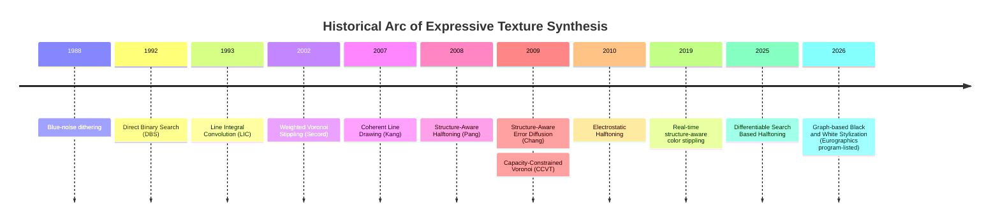

# Computational Synthesis of Expressive Textures: A Unified Framework for Geometric, Vector Field, and Optimization Architectures

## 1. Executive Summary and Problem Taxonomy

Across non-photorealistic rendering (NPR), stippling, hatching, and digital halftoning, the core problem remains consistent: given an image, continuous-tone field $I(x)$, or 3D surface, construct a discrete or semi-discrete texture field $T(x)$ whose low-frequency appearance matches the target tone/color, whose local organization preserves structural geometry, and whose micro-pattern avoids objectionable artifacts such as clumping, false contours, and moiré.

Rather than merely reducing visual bandwidth, artistic stylization processes translate color and tone transitions into dynamic, structured patterns that serve as expressive media. To control how these discrete elements are placed, modern graphics pipelines rely on three foundational mathematical architectures:

1. **Geometry-Based Methods:** Convert tone into point density or cell geometry (e.g., Voronoi constructions).
2. **Vector-Field Methods:** Extract an orientation field and align marks, filters, or streamlines with it.
3. **Optimization-Loop Methods:** Explicitly minimize a perceptual, structural, or physical objective.

A useful unifying abstraction is to treat the renderer as solving a constrained synthesis problem on an image domain $\Omega$:
$$ \min_{T} \; \lambda_{\text{tone}}\,\mathcal T(I,T) + \lambda_{\text{structure}}\,\mathcal S(I,T) + \lambda_{\text{orientation}}\,\mathcal O(I,T) + \lambda_{\text{spectrum}}\,\mathcal B(T) + \lambda_{\text{device}}\,\mathcal D(T) $$

This equation maps directly to the strongest algorithms in the field: Voronoi tessellation energies, streamline ODEs, and explicit objective functions involving human visual system (HVS) filtering and structural similarity (SSIM).



Implementation map: `DESIGN.md` §14 uses §4.1–§4.2 for Phase 2, §2.2 and §3.1 for Phase 3, §2.1–§2.3 plus §5 for Phase 4, and §4.3 for Phase 5.

---

## 2. Optimization-Loop Families: Halftoning and Binary Textures

Optimization-loop methods explicitly encode what "good texture" means, then iteratively improve a discrete pattern. This family is the gold standard for structure-faithful binary stylization and print-quality halftoning.

### 2.1 Model-Based Direct Binary Search (DBS)

The classical highest-quality regime is DBS, which minimizes the squared error between the output of the printer-plus-vision cascade on the halftone image and the continuous-tone image: $E = \sum (\tilde z_{ij} - \tilde p_{ij})^2$. The algorithm scans the image, testing pixel toggles and neighbor swaps, keeping changes that reduce visual error. While combinatorial, rapid local error updates make it a practical reference standard.

### 2.2 Global Optimization and Structure-Aware Halftoning (Class III)

Pang et al. formulated dot placement as the minimization of an energy functional that explicitly balances local tone matching and structural similarity (MSSIM):
$$ E(I, I_h) = w_g \cdot G(I, I_h) + w_t \cdot (1 - MSSIM(I, I_h)) $$
The term $G(I, I_h)$ is the tone similarity (distance between Gaussian-smoothed images), and the SSIM metric preserves high-frequency semantics:
$$ SSIM(\mathbf{x}, \mathbf{y}) = \frac{(2\mu_x\mu_y + C_1)(2\sigma_{xy} + C_2)}{(\mu_x^2 + \mu_y^2 + C_1)(\sigma_x^2 + \sigma_y^2 + C_2)} $$

**Implementation Skeleton:**

```python
def structure_aware_halftone(gray, init=None):
    H = init_binary_with_same_grayness(gray) if init is None else init
    E = objective(gray, H)   # tone MSE on blurred images + (1 - MSSIM)
    T = 0.2 # Annealing temperature
    while T > 0.01:
        for _ in range(gray.size):
            H2 = swap_one_black_and_one_white_pixel(H)
            E2 = objective(gray, H2)
            if rng.uniform() < np.exp(min(0.0, -(E2 - E) / T)):
                H, E = H2, E2
        T *= 0.8
    return H
```

### 2.3 Structure-Aware Error Diffusion (SAED) (Class II)

Because global optimization takes minutes, SAED achieves comparable quality at feed-forward speeds. SAED replaces constant thresholding with a spatially-varying threshold generated by convolving the input image $Img$ with an anisotropic Gabor filter aligned to the local dominant orientation $\theta$:
$$ Gabor\_{\theta,f}(x, y) = \exp\left( -\frac{x'^2 + y'^2}{2\sigma_G^2} \right) \cos(fx') + c $$

```text
             y-axis ^
                    |       y' (Rotated Axis, oriented along theta)
                    |      /
                    |     /
         -----------+-----------------------> x-axis
                   /|   <-- rotation angle theta
                  / |
```

_Figure 1: Coordinate rotation transformation for Gabor-based threshold modulation. The rotated coordinates align the thresholding kernel with the local dominant texture._

Additionally, SAED dynamically transitions from isotropic error diffusion coefficients to structure-aligned anisotropic coefficients $H_b(x, y)$ to prevent quantization error from leaking across sharp visual boundaries.

Alternative optimization methods include **Contrast-Aware Halftoning** (which routes positive/negative quantization errors preferentially to light/dark pixels to sharpen boundaries) and **Electrostatic Halftoning** (which treats pixels as charged particles repelled by each other but attracted to image darkness).

---

## 3. Geometry-Based Families: Stippling and Point Sets

Geometry-based methods map color transitions into texture by constructing a point set or cell complex whose _local density_ reflects tone and whose _metric_ encodes structure.

### 3.1 Density-Weighted Centroidal Voronoi Tessellations (CVT)

Adrian Secord formulated stippling as a Weighted CVT. The local density is governed by $\rho(\mathbf{x}) = 1 - f(\mathbf{x})$. Lloyd's relaxation is used to move each generator point $x_i$ to the centroid of its Voronoi region $V_i$:
$$ C_{i,x} = \frac{\int_{V_i} x \rho(x, y) dA}{\int_{V_i} \rho(x, y) dA}, \quad C_{i,y} = \frac{\int_{V_i} y \rho(x, y) dA}{\int_{V_i} \rho(x, y) dA} $$

**Implementation Skeleton:**

```python
def weighted_cvt_stipple(gray, n_sites, n_iters):
    rho = 1.0 - gray
    sites = initialize_points_by_density(rho, n_sites) # Importance sampling
    for _ in range(n_iters):
        cells = rasterized_voronoi(sites, gray.shape)
        moments = weighted_cell_moments(cells, rho)
        new_sites = [(mx/m0, my/m0) if m0 > 0 else resample(rho) for m0, mx, my in moments]
        if mean_displacement(sites, new_sites) < tol: break
        sites = new_sites
    return sites
```

### 3.2 Efficient Row-by-Row 1D Integration

Evaluating 2D integrals over polygonal Voronoi regions is a bottleneck. The standard optimization is to convert the 2D integrals into 1D iterated integrals. Two auxiliary functions, $P(x, y) = \int_0^x \rho(s, y) ds$ and $Q(x, y) = \int_0^x P(s, y) ds$, are precomputed.

```text
     y-axis ^
            |     +-------------------------+
         y2 |----+ \                       / +----  (Upper boundary V_i)
            |    |  \                     /  |
          y |----+===x1(y)==============x2(y)+----  (Scanline Segment)
            |    |  /                     \  |
         y1 |----+ /                       \ +----  (Lower boundary V_i)
            +----+-------------------------+------> x-axis
```

_Figure 2: 1D scanline integration. By evaluating precomputed functions $P$ and $Q$ at boundaries $x_1(y)$ and $x_2(y)$, computational complexity drops drastically._

Advanced geometric methods include **Capacity-Constrained Voronoi Tessellation (CCVT)**, which enforces strict area constraints to eliminate semi-regular artifacts, and **Optimal Transport Sampling**, which utilizes continuous Wasserstein barycenters to optimize thousands of point constraints simultaneously for multi-class color stippling.

---

## 4. Vector-Field Architectures: Line Synthesis and Hatching

Vector-field methods assert that texture should not only match tone but _flow with perceived shape_. This family dominates line drawing, painterly strokes, and 3D surface hatching.

### 4.1 Edge Tangent Flow (ETF) and Bilateral Smoothing

Standard gradients contain high-frequency noise. An ETF is a smooth vector field $\mathbf{t}(\mathbf{x})$ orthogonal to the local gradient. To build global alignment, a vector-based bilateral smoothing filter is applied:
$$ \mathbf{t}'(\mathbf{x}) = \frac{1}{k(\mathbf{x})} \sum\_{\mathbf{z} \in \Omega(\mathbf{x})} w_s \cdot w_m \cdot w_d \cdot \mathbf{t}(\mathbf{z}) \cdot \text{sgn}(\mathbf{t}(\mathbf{z}) \cdot \mathbf{t}(\mathbf{x})) $$

- $w_s$: Spatial weight (Euclidean decay).
- $w_m$: Magnitude weight (preserves dominant edges).
- $w_d$: Direction weight (prevents blurring across orthogonal corners).
- $\text{sgn}$: **Bidirectional Sign Alignment**. Flips neighboring vectors if they point in the opposite half-plane, preventing mutual cancellation (essential for orientation math).

### 4.2 Streamline Integration (FDoG and VTF)

Lines are generated by tracing streamlines $\gamma(s)$ through the ETF.
The Flow-based Difference-of-Gaussian (FDoG) filter evaluates strokes by accumulating structural evidence along the flow:
$$ H(x) = \int_{-S}^{S}\int_{-T}^{T} I(l_{x,s}(t))\,f(t)\,G_{\sigma_m}(s)\,dt\,ds $$
Alternatively, the **Value-Through-the-Flow (VTF)** measures pixel intensity/gradient averages along the streamline to determine stroke membership.

### 4.3 3D Surface Hatching: N-RoSy Fields and Tonal Art Maps

Extending vector fields to 3D surfaces requires handling arbitrary manifolds. Hatching lines are modeled as rotational symmetry fields (**N-RoSy**). To smooth a cross-field over a 3D mesh, discrete parallel transport rotates complex coefficients $u_i$ between adjacent tangent planes to minimize Dirichlet energy.

```text
                 Face f_j
                +-------+
               /    ^    \
              /     | u_j \
           +-------eij-------+ <--- Shared Edge e_ij
            \       | u_i   /
             \      v      /
                 Face f_i
```

_Figure 3: Geodesic parallel transport aligns cross-field vectors across mesh faces._

To render strokes without "swimming" artifacts during camera movement, **Tonal Art Maps (TAMs)** are used. TAMs enforce stroke nesting: strokes present in a lighter tone/coarser scale must be preserved in all darker tones/finer scales. Suggestive hatching can further adapt these strokes to **shading vector fields** ($\nabla I$) to dynamically respond to 3D lighting.

---

## 5. Emerging Neural and Hybrid Paradigms

The field is actively bridging classical geometric constraints with deep learning. Modern neural style transfer relies on these hybrid formulations to ensure spatial and temporal coherence:

- **Vector-Flow Aware GANs:** Use an Image-to-Flow network (I2FNet) to learn ETF fields, fusing them with image gradients via a Double Flow Generator (DFG) to enforce brushstroke alignment.
- **Neural VTF:** Replaces standard streamline integration with a multi-layered wide-pass network, acting as a learnable filter to extract strokes from noisy structural contexts.
- **Generative Optimal Transport:** Uses the Wasserstein-2 distance to match subband feature distributions (e.g., in GIST), aligning content and style explicitly without heuristic regularization. Differentiable Search Based Halftoning models dot assignment with a differentiable relaxation and reports better speed/scaling than stochastic search-based optimization.

---

## 6. Engineering Trade-offs and Parameter Mapping

The decision of which algorithm to use depends on rendering goals, as highlighted in the architectural trade-offs below.

### 6.1 Computational Complexity & Performance

| Family           | Representative Algorithm     | Approx. Complexity                                  | Real-Time Capability     | Primary Output                  |
| :--------------- | :--------------------------- | :-------------------------------------------------- | :----------------------- | :------------------------------ |
| **Geometry**     | Weighted Voronoi / LBG       | $\mathcal{O}(P \log S)$ or raster-nearest per iter  | GPU/Precomputed variants | Stipples, mosaics               |
| **Optimization** | Pang et al. (Sim. Annealing) | $\mathcal{O}(P \cdot Iters)$ global                 | No (minutes)             | High-fidelity halftones         |
| **Optimization** | SAED / Contrast-Aware        | $\mathcal{O}(P)$ feed-forward after calibration     | Yes (< 1 second)         | Structure-aware halftones       |
| **Optimization** | Electrostatic Halftoning     | $\mathcal{O}(S^2)$ naively                          | Fast via NFFT            | High spectral quality dithering |
| **Vector Field** | Coherent Line Drawing / ETF  | $\mathcal{O}(P(\sigma+\tau))$ separable             | Near-interactive         | Flowing strokes, hatches        |

Here, $P$ is the number of image pixels and $S$ is the number of sites/dots/strokes. CVT cost depends heavily on how nearest-site assignment and cell moments are computed; the row-integration trick above reduces centroid integration cost but does not make the whole iteration literally linear in site count.

### 6.2 Mapping Mathematics to Visual Style

| Parameter / Control                | Mathematical Role                   | Visual / Perceptual Effect                    |
| :--------------------------------- | :---------------------------------- | :-------------------------------------------- |
| **Density field $\rho(x)$**        | Target point capacity in CVT        | Darker regions get denser marks               |
| **Anisotropic metric**             | Reshapes placement energy           | Dots stretch along forms; directional texture |
| **ETF smoothing iterations**       | Regularizes orientation             | Longer, cleaner, coherent strokes             |
| **FDoG $\sigma_m$ and $\sigma_c$** | Flow integration length / DoG scale | Stroke connectivity and line width            |
| **$w_g/w_t$ ratio**                | Balances tone MSE vs. MSSIM         | Stronger texture preservation vs. tone blur   |
| **Electrostatic regularity**       | Balances attraction/repulsion       | More ordered/mechanical vs. loose/organic     |

---

## 7. Evaluation Practices and Open Questions

Benchmarking expressive texture is highly fragmented. A robust evaluation protocol should utilize the following dataset-and-metric combinations:

- **Tone-Faithful Halftoning:** _Kodak, DIV2K_. Evaluated via blurred-domain MSE/PSNR and SSIM.
- **Structure-Aware Stylization:** _BSDS500_. Evaluated via MSSIM, orientation agreement, and boundary preservation.
- **Dynamic / Video stylization:** _DAVIS_. Evaluated via temporal warping error and contour persistence.
- **Spectral Quality:** Radial Fourier power distribution and pair-correlation metrics (crucial for verifying blue-noise properties).

### Future Outlook

1. **Unified Objective Functions:** The field still lacks a single, widely accepted perceptual objective that jointly captures tone, MSSIM structure, blue-noise spectra, and temporal coherence.
2. **Controllable Differentiability:** While differentiable search (Luci et al.) and Deep RL show promise, the field needs relaxations that preserve discrete visual character without introducing mode collapse or training-data bias.
3. **Editable NPR Textures:** Real artists care about editability and vector control. Graph-based vectorization pipelines (2026) represent the bleeding edge, shifting the focus from static raster maps to editable, topologically sound vector outputs.

### Implementation Details To Research Before Building

- **HVS/device cascade:** DBS and related model-based halftoning need a concrete contrast-sensitivity / printer-vision model, not just a generic SSIM/MSE objective.
- **ETF smoothing:** Implementation needs the exact gradient preprocessing, bilateral weights, sign alignment, and regularization choices that make the field stable rather than noisy.
- **TAM construction:** Mesh hatching requires the tonal-art-map nesting protocol before the renderer can promise no swimming or popping across tone/scale changes.

---

## 8. References and Audit Trail

These are the sources to check before turning a family into implementation work:

- Ulichney, "Dithering with Blue Noise," Proceedings of the IEEE, 1988.
- Analoui and Allebach, "Model-Based Halftoning Using Direct Binary Search," SPIE, 1992. DOI: [10.1117/12.135959](https://doi.org/10.1117/12.135959).
- Cabral and Leedom, "Imaging Vector Fields Using Line Integral Convolution," SIGGRAPH 1993. DOI: [10.1145/166117.166151](https://doi.org/10.1145/166117.166151).
- Secord, "Weighted Voronoi Stippling," NPAR 2002. DOI: [10.1145/508530.508537](https://doi.org/10.1145/508530.508537).
- Kang, Lee, and Chui, "Coherent Line Drawing," NPAR 2007. Record: [NPCG Library](https://www.npcglib.org/paper.php?entryid=771).
- Pang, Qu, Wong, Cohen-Or, and Heng, "Structure-Aware Halftoning," ACM TOG / SIGGRAPH 2008. Project page: [Structure-Aware Halftoning](https://ttwong12.github.io/papers/structurehalftone/structurehalftone.html).
- Chang, Alain, and Ostromoukhov, "Structure-Aware Error Diffusion," ACM TOG / SIGGRAPH Asia 2009. PDF: [Structure-Aware Error Diffusion](https://perso.liris.cnrs.fr/ostrom/publications/pdf/SIGGRAPH-ASIA09_saed.pdf).
- Balzer, Schloemer, and Deussen, "Capacity-Constrained Point Distributions: A Variant of Lloyd's Method," ACM TOG 2009. DOI: [10.1145/1531326.1531392](https://doi.org/10.1145/1531326.1531392).
- Schmaltz, Gwosdek, Bruhn, and Weickert, "Electrostatic Halftoning," Computer Graphics Forum 2010. DOI: [10.1111/j.1467-8659.2010.01716.x](https://doi.org/10.1111/j.1467-8659.2010.01716.x).
- Ma, Li, Li, and Zhang, "Real-Time Structure Aware Color Stippling," SIGGRAPH Posters 2019. DOI: [10.1145/3306214.3338606](https://doi.org/10.1145/3306214.3338606).
- Luci, Wijaya, and Babaei, "Differentiable Search Based Halftoning," Computer Graphics Forum 2025. DOI: [10.1111/cgf.70173](https://doi.org/10.1111/cgf.70173).
- Sattari Javid, Lord, and Mould, "Graph-based Black and White Stylization," Eurographics 2026 program listing: [EG 2026 Full Paper 2](https://eg2026.github.io/program/).

---

**Conclusion:** The best modern graphics systems rely on architectural decomposition: use _geometry_ to control density and blue-noise structure, use _vector fields_ to guide orientation and coherence, and use _optimization loops_ (or their neural equivalents) to enforce rigorous perceptual fidelity.
